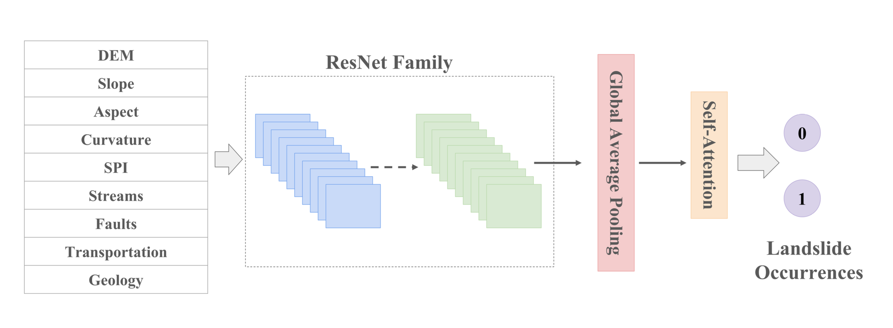
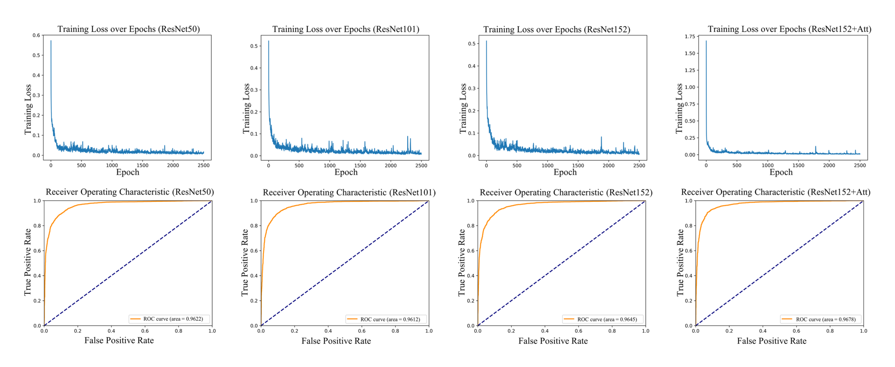

# Improved Landslide Susceptibility Mapping in Uttaradit, Thailand Using Deep Residual Networks with Self-Attention Mechanisms

[](LICENSE)

**Author**: Teerapong Panboonyuen (Kao Panboonyuen)  
**Project**: [geoai-landslides](https://github.com/kaopanboonyuen/geoai-landslides)  
### **Publication**: [Improved Landslide Susceptibility Mapping in Uttaradit, Thailand Using Deep Residual Networks with Self-Attention Mechanisms](https://kaopanboonyuen.github.io/geoai-landslides)

## Abstract

Landslides pose considerable risks, leading to extensive damage to infrastructure and economic setbacks. Accurate landslide susceptibility mapping is crucial for effective risk mitigation strategies. Traditional approaches often face difficulties due to the complex, nonlinear relationships between various factors such as geology, hydrology, and meteorology. This study proposes an enhanced ResNet152 model integrated with multi-head self-attention mechanisms to address these challenges. By capturing complex spatial dependencies within geospatial data, the proposed method significantly improves the accuracy of landslide susceptibility predictions.


## Key Features

- **Enhanced Model**: Integrates self-attention into ResNet152 to improve feature extraction and mapping accuracy.
- **Performance Metrics**: Achieves a precision of 91.44%, recall of 91.74%, F1-score of 91.59%, and ROC-AUC of 0.9678.
- **Robust Framework**: Provides a more accurate and interpretable model for landslide susceptibility assessment.

## Installation

To set up the project environment, first clone the repository:

```bash
git clone https://github.com/kaopanboonyuen/geoai-landslides.git
cd geoai-landslides
```

Then, install the required dependencies:

```bash
pip install -r requirements.txt
```

## Usage

1. **Configure Settings**: Modify the `config.yaml` file to set paths, parameters, and other configurations.
2. **Training**: Run the training script to train the model on your dataset:
    ```bash
    python train.py
    ```
3. **Evaluation**: Evaluate the model's performance using the evaluation script:
    ```bash
    python evaluate.py
    ```
4. **Inference**: Perform inference and obtain susceptibility maps:
    ```bash
    python inference.py
    ```

## Data

- **Geospatial Data**: The dataset used for training and evaluation is not included in this repository. Please refer to the documentation for guidance on acquiring and preparing geospatial data.




## Project Website

For additional details, visit the project website: [geoai-landslides](https://kaopanboonyuen.github.io/geoai-landslides).

## Citation

If you use this project in your research, please cite the following publication:

```bibtex
@inproceedings{panboonyuen2025geoailandslides,
  title={Improved Landslide Susceptibility Mapping in Uttaradit, Thailand Using Deep Residual Networks with Self-Attention Mechanisms},
  author={Teerapong Panboonyuen},
  year={2024}
}
```

## License

This project is licensed under the MIT License. See the [LICENSE](LICENSE) file for details.

## Acknowledgments

- **Publication**: This project is based on the paper presented at the conference.
- **Contributors**: Special thanks to the contributors and collaborators who helped in developing this model.

For further questions or contributions, please open an issue or create a pull request in the repository. Thank you for your interest in our work!